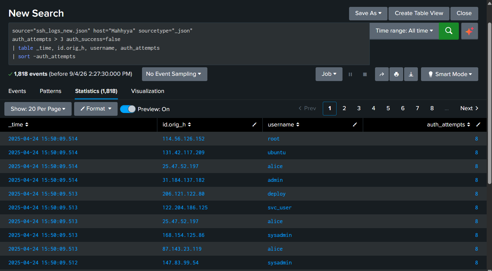
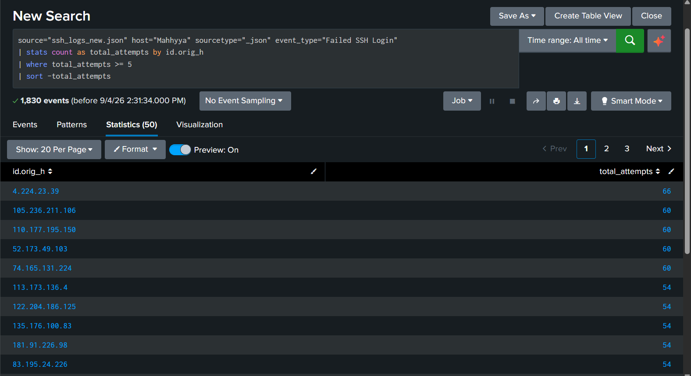
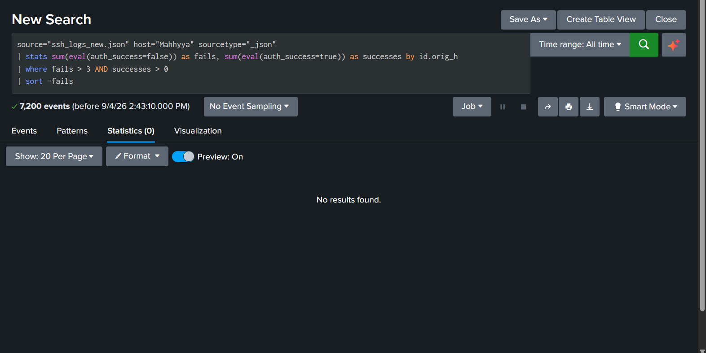
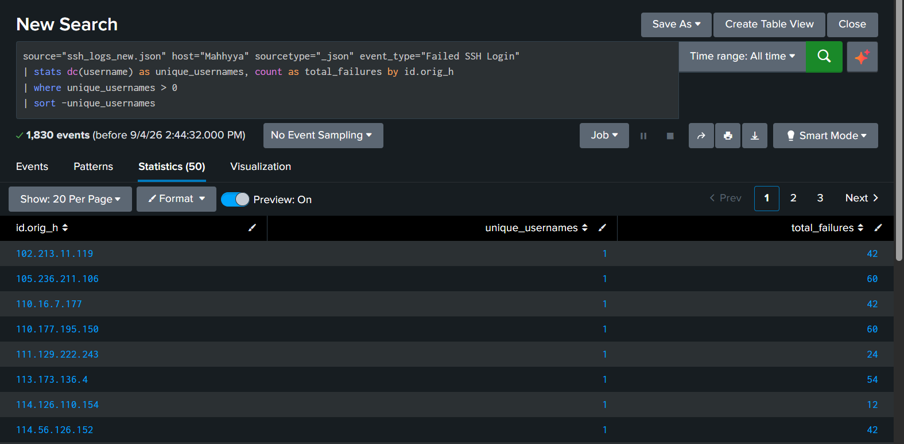

# 04 — Brute Force Detection
 
## Goal
Move beyond raw failed-login counts to detect actual brute-force *patterns* — repeated attempts within a short time window, and cases where an attacker eventually succeeded after multiple failures.
 
## Detection Approaches
 
**A — High attempt count per connection**
Uses Zeek's own `auth_attempts` counter (attempts within a single connection):
```spl
source="ssh_logs_new.json" host="Mahhyya" sourcetype="_json"
auth_attempts > 3 auth_success=false
| table _time, id.orig_h, username, auth_attempts
| sort -auth_attempts 
```
 
**B — Time-window brute force**
Flags source IPs with 5+ cumulative failed attempts within a 5-minute window (catches attackers cycling through multiple connections):
```spl
source="ssh_logs_new.json" host="Mahhyya" sourcetype="_json" event_type="Failed SSH Login"
| bin _time span=5m
| stats sum(auth_attempts) as total_attempts, dc(username) as usernames_tried by id.orig_h, _time
| where total_attempts >= 5
| sort -total_attempts 
```
 
**C — Brute-force-then-breach**
The strongest signal: an IP that failed repeatedly and then succeeded.
```spl
source="ssh_logs_new.json" host="Mahhyya" sourcetype="_json"
| stats count(eval(event_type="Failed SSH Login")) as fails, count(eval(event_type="Successful SSH Login")) as successes by id.orig_h
| where fails > 3 AND successes > 0
| sort -fails 
```
 
**D — Password spraying check**
One IP trying many different usernames with few attempts each (a different attack pattern than classic brute force):
```spl
source="ssh_logs_new.json" host="Mahhyya" sourcetype="_json" event_type="Failed SSH Login"
| stats dc(username) as unique_usernames, count as total_failures by id.orig_h
| where unique_usernames > 5
| sort -unique_usernames 
```
 
## Why Time Windows Matter
A handful of failed logins scattered across a day is normal user error. The same volume compressed into a 5-minute window is a strong brute-force signature — that's why detection B bins on `_time span=5m` rather than just counting failures overall.
 
## Findings
- IPs flagged by Approach B: _fill in_
- Any brute-force-then-breach IPs found (Approach C): _fill in_
- Password spraying detected: _fill in / none observed_
## Screenshots
 
**Approach A — High attempt count per connection**

 
**Approach B — Time-window brute force**

 
**Approach C — Brute-force-then-breach**

 
**Approach D — Password spraying check**
): _fill in_
- Password spraying detected: _fill in / none observed_
## Screenshots
Add screenshots for each approach's result table as `screenshots/approach-a.png`, `screenshots/approach-b.png`, `screenshots/approach-c.png`, `screenshots/approach-d.png`.
