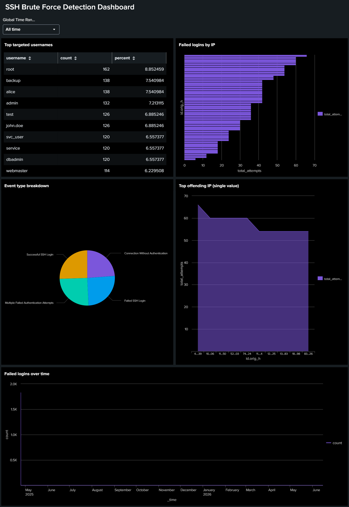

# SSH Brute Force Detection using Splunk

A SIEM-based detection project using **Splunk Enterprise** to identify brute-force SSH login attempts from Zeek/Bro-formatted SSH connection logs — covering data ingestion, detection logic (SPL), a monitoring dashboard, and a real-time alert.

---

## 🎯 Objective
Simulate a real-world SOC analyst workflow: ingest raw SSH authentication logs into Splunk, write detection queries to surface failed logins and brute-force patterns, visualize the findings on a dashboard, and configure an alert to flag active attacks.

---

## 🏗️ Architecture
```
[ssh_logs_new.json (Zeek/Bro SSH logs)]
              ↓
      [Splunk Index: ssh_logs]
              ↓
     [SPL Detection Queries]
       ↓                ↓
 [Dashboard]        [Alert]
```

---

## 🛠️ Tools & Environment
- **Splunk Enterprise** (Windows)
- **Data format:** Zeek/Bro SSH connection logs, JSON (`sourcetype="_json"`)
- **Host:** Mahhyya

---

## 📂 Project Structure
| Folder | Contents |
|---|---|
| [`01-install`](./01-install) | Splunk installation steps & proof screenshots |
| [`02-add-data`](./02-add-data) | Data onboarding process, index setup, field verification |
| [`03-failed-logins`](./03-failed-logins) | Failed login detection queries & results |
| [`04-brute-force`](./05-brute-force) | Brute-force & brute-force-then-breach detection logic |
| [`05-alerts`](./07-alerts) | Alert configuration & triggered alert evidence |
| [`06-dashboards`](./06-dashboards) | Exported dashboard source (JSON) & screenshots |
| [`07-spl-queries`](./03-spl-queries) | Full SPL query reference used throughout the project |
---

## 🔑 Key Fields (Zeek/Bro SSH schema)
| Field | Meaning |
|---|---|
| `id.orig_h` | Source IP (client/attacker) |
| `id.resp_h` | Destination IP (SSH server) |
| `event_type` | Event category (e.g. "Failed SSH Login", "Successful SSH Login") |
| `auth_attempts` | Number of auth attempts in that connection |
| `auth_success` | true/false — login outcome |
| `username` | Username attempted |
| `ts` | Event timestamp |

---

## 🔍 Detection Logic Summary

**Failed Logins**
```spl
source="ssh_logs_new.json" host="Mahhyya" sourcetype="_json" event_type="Failed SSH Login"
| stats count by id.orig_h
| sort -count
```

**Brute Force (time-window based)**
```spl
source="ssh_logs_new.json" host="Mahhyya" sourcetype="_json" event_type="Failed SSH Login"
| bin _time span=5m
| stats sum(auth_attempts) as total_attempts by id.orig_h, _time
| where total_attempts >= 5
```

**Brute-Force-Then-Breach (strongest finding)**
```spl
source="ssh_logs_new.json" host="Mahhyya" sourcetype="_json"
| stats sum(eval(auth_success=false)) as fails, sum(eval(auth_success=true)) as successes by id.orig_h
| where fails > 3 AND successes > 0
```

Full query set with explanations: [`07-spl-queries/queries.md`](./07-spl-queries/queries.md)

---

## 📊 Dashboard
Built in Dashboard Studio with panels for:
- Failed logins over time
- Top attacking IPs
- Top targeted usernames
- Success vs. failure ratio
- Brute-force-then-breach IPs



---

## 🚨 Alert
Configured a scheduled alert on the brute-force detection query (5-min interval, triggers when `total_attempts >= 5` for any source IP).


---

## 📌 Key Findings
- **Top attacking IP:** _fill in_
- **Most targeted username:** _fill in_
- **Brute-force-then-breach IPs identified:** _fill in_
- **False positives observed:** _fill in_

---

## 💡 What I Learned
- How to onboard JSON-formatted log data into Splunk and verify field extraction
- Writing SPL to detect authentication anomalies using `stats`, `bin`, and `eval`
- Distinguishing simple failed-login noise from genuine brute-force patterns using time windows and attempt thresholds
- Building and exporting Splunk dashboards as reusable source code
- Configuring scheduled alerts for real-time-style detection

## 🔮 What I'd Improve
- Add a live/streaming data source instead of a static file
- Integrate with a threat intel feed to enrich `id.orig_h` with geolocation/reputation
- Add email/webhook alert actions instead of just triggered-alerts logging

---

## 🔗 Related Projects
- [Nmap Network Reconnaissance](https://github.com/Mahhyya/Nmap-Network-Reconnaissance)
